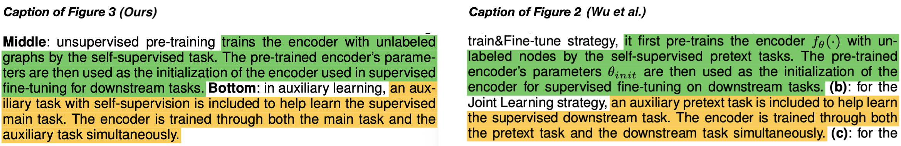
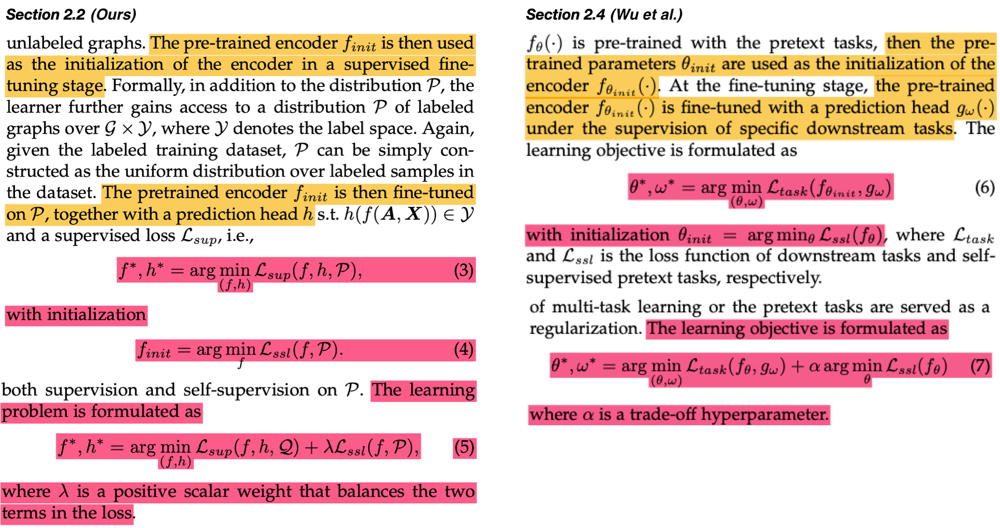
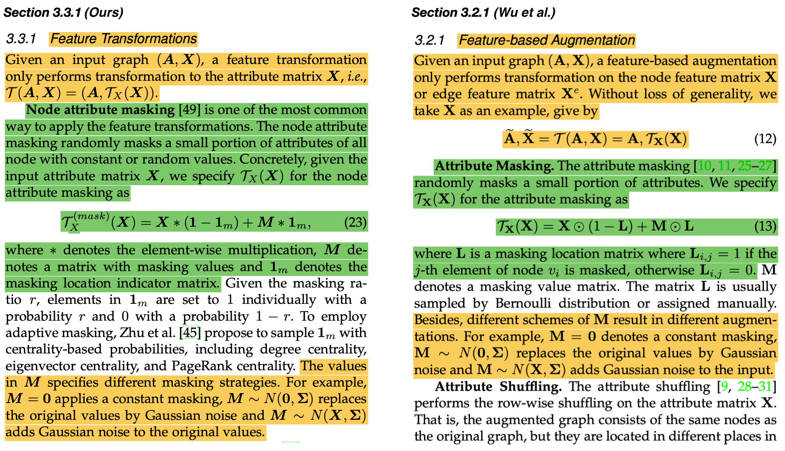
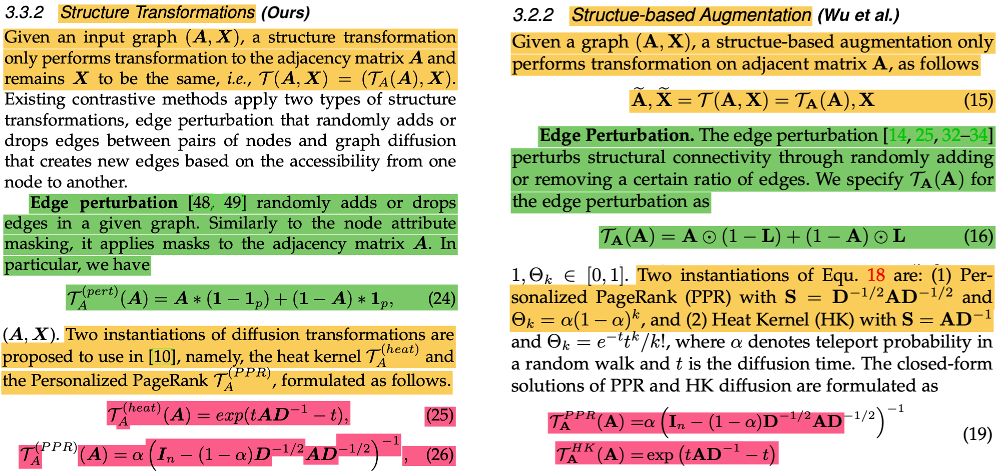
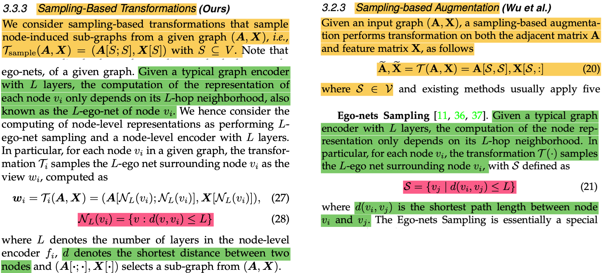
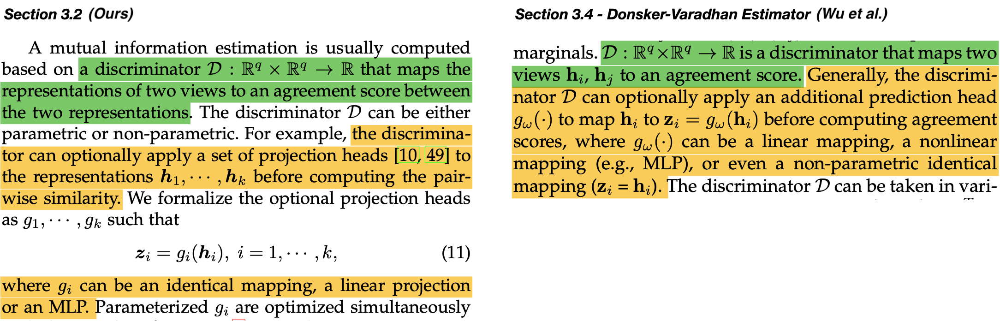
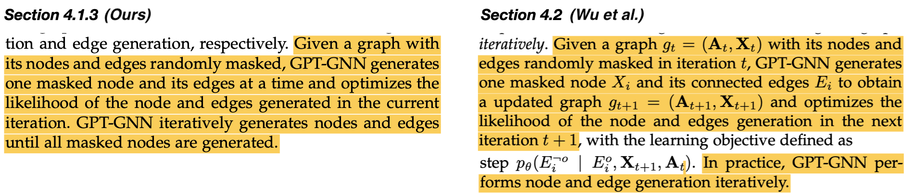
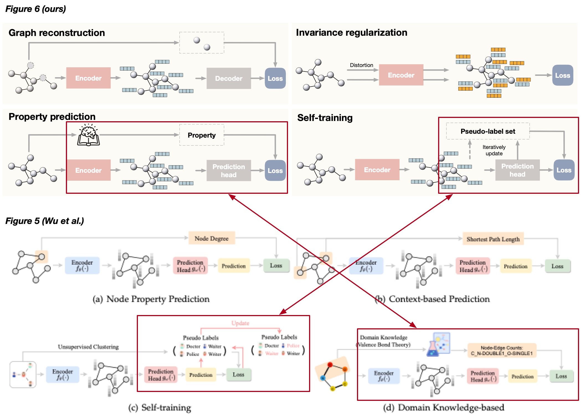

# Awesome-coincidences-between-two-papers
The repository includes evidences that a published paper in TKDE shares surprisingly high similarity to our paper.

We are recently brought awareness that a survey paper ***Self-supervised Learning on Graphs: Contrastive, Generative,or Predictive*** by Lirong Wu et al., published in *IEEE Transactions on Knowledge and Data Engineering*, shares a very high similarity to our paper ***Self-supervised learning of graph neural networks: A unified review*** published in *IEEE Transactions on Pattern Analysis and Machine Intelligence*. 

Although it is very possible that two survey papers on a same topic can share similar formulations and method descriptions, we are surprised that our **method taxonomy**, **paper organizations/storylines**, **figures**, **unified frameworks**, and many other **unique insights** to the topic also appear in their paper. Given the similarity in many individual dimensions of the two papers, we believe that the likelihood that the two papers are from a joint distribution is significantly higher than that they are independently from mariginal distributions. 

Below we summarize the timeline and provide a list of evidences about the similarity.

## Timeline

On Febuary 22, 2021, the first version of our review paper was made available on [arXiv](https://arxiv.org/abs/2102.10757v1). **Three months later**, on May 16, 2021, the paper by Wu et al. became available on [arXiv](https://arxiv.org/abs/2105.07342v1). After that, the paper by Wu et al. and our paper was published on December 1, 2021 and April 27, 2022, respectively.

## Evidences Exhibits

We compare several similar elements in terms of figures and text in the following figures.

### Text

- Identical statements between the captions. 

- Identical/similar statements and formulations. To the best of our knowledge, we are the first to summarize and formulate the taxonomy on paradigms of using SSL, which is not widely used before.

- Identical/similar statements and formulations. To the best of our knowledge, we are the first to unify existing contrastive approaches, by identifying their connections among each other.

- Identical/similar statements and formulations. To the best of our knowledge, we are the first to use these formulations to summarize and categorize agumentations for graphs.

- Identical/similar statements and formulations. To the best of our knowledge, we are the first to use these formulations to summarize and categorize agumentations for graphs.

- Identical/similar statements and formulations. To the best of our knowledge, we are the first to use these formulations to summarize and categorize agumentations for graphs.

- Identical/similar statements. To the best of our knowledge, we are the first to consider projection heads from a parameterized MI estimator perspective of view.

- Identical/similar statements and formulations. To the best of our knowledge, we are the first to summarize the equivalences or connections among contrastive objectives.

- Identical/similar statements and formulations. To the best of our knowledge, we are the first to summarize the equivalences or connections among contrastive objectives.

- Identical/similar statements.

- Identical/similar statements.

- Identical/similar statements.

### Figures

- Identical/similar content in figures.

- Identical/similar content in figures.

